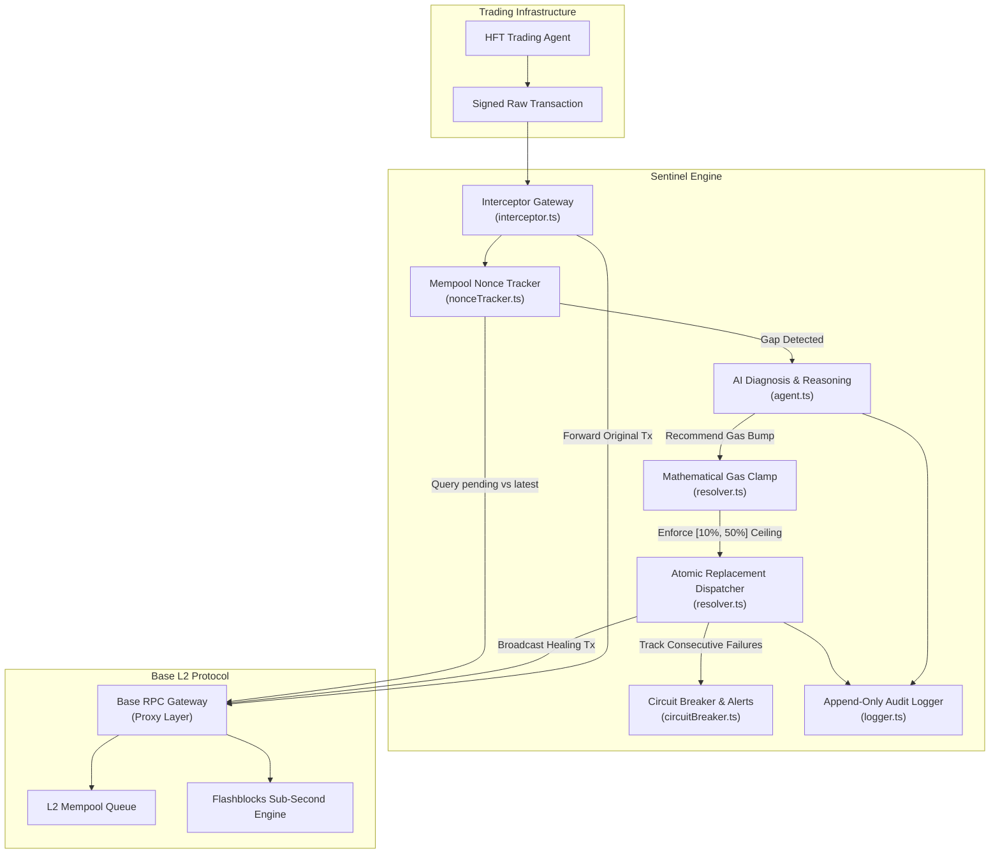
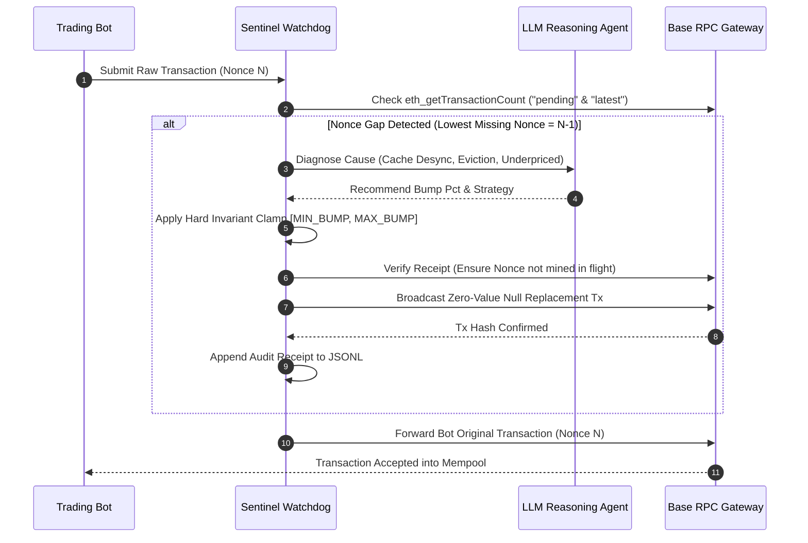

# Sentinel

<p align="center">
  <strong>Autonomous Nonce-Gap Watchdog & Self-Healing Mempool Pipeline for High-Frequency Trading on Base L2</strong>
</p>

<p align="center">
  
  
  
  
</p>

<p align="center">
  <a href="https://sentinel-sigma-six.vercel.app"><strong>Live Observatory</strong></a> •
  <a href="https://sentinel-sigma-six.vercel.app/docs"><strong>Documentation Portal</strong></a> •
  <a href="https://sentinel-dqla.onrender.com/api/health"><strong>Backend Gateway (Render)</strong></a>
</p>

---

## Overview

High-frequency algorithmic trading agents on Base submit tens of transactions per second. Under volatile gas conditions or rapid block production, a single transaction can stall or drop due to Base Flashblocks nonce-reporting desynchronization. 

Because EVM account nonces are strictly sequential, a single delayed transaction blocks all subsequent orders queued behind it. This creates a cascade of failed trades, stale inventory risk, and lost arbitrage opportunities.

**Sentinel** is an autonomous, non-custodial watchdog that intercepts outbound transactions, continuously monitors mempool queues, diagnoses stalled nonces with AI reasoning, and executes atomic, safely-clamped replacement transactions in milliseconds.

---

## Core Thesis: &ldquo;Model Proposes, Code Decides&rdquo;

> **&ldquo;The AI reasons, it never touches a gas fee directly.&rdquo;**

Most Web3 AI agent implementations blindly execute whatever prompt completion an LLM returns. In high-frequency blockchain trading, this is a catastrophic anti-pattern that leads to gas depletion loops and drained capital.

Sentinel enforces a strict separation of concerns:
1. **The AI Proposes**: The LLM reasoning agent diagnoses why the transaction stalled (silent eviction, network gas spike, or Flashblocks sequencer desync) and suggests an optimal gas bump percentage.
2. **Code Decides**: Hard mathematical safety clamps (`INV-02`) bound every recommendation between `[10%, 50%]`.
3. **Tested to Fail Safely**: In automated tests (`test/sentinel.test.ts`), a simulated 200% bump request gets strictly clamped to 50%. If the LLM times out or returns malformed JSON, Sentinel automatically falls back to the safety-floor bump (+10%) without halting execution. Both the raw proposal and the clamped execution are cryptographically committed to append-only JSONL receipts for BaseScan auditability.

---

## A Real, Documented Problem (Not Self-Justified)

Sentinel solves a documented, independently verifiable race condition published in Base's official engineering blog:
- **Base Flashblocks Sub-Second Sequencing**: Base streams partial blocks every ~200ms. If a trading bot's local sequence falls out of sync with the sequencer by even one sub-block, every subsequent submission errors with `NONCE_TOO_LOW` or halts in `QUEUED` deadlock.
- **Base's Silent Eviction Quirk**: When sequencer queues fill under load, Base drops underpriced transactions **without emitting an eviction event or error callback**. The bot assumes the transaction is pending forever. Sentinel infers silent evictions using consecutive propagation timeouts and autonomously resubmits.

---

## System Architecture



---

## Nonce Healing Lifecycle



---

## Three-Layer Institutional Security Model

```mermaid
graph LR
    subgraph Layer1["Layer 1: Private Key Isolation"]
        EnvKey["process.env.PRIVATE_KEY"]
        GasWallet["Dedicated Operational Gas Wallet"]
        ZeroMask["UI Masked: [Loaded]"]
    end

    subgraph Layer2["Layer 2: RPC Gateway & API Security"]
        BackendProxy["Server-Side Proxy (/api/*)"]
        Https["Mandatory TLS / HTTPS"]
        SafeCompare["crypto.timingSafeEqual"]
    end

    subgraph Layer3["Layer 3: Application Defense"]
        Headers["OWASP Security Headers"]
        ProtoDrop["Prototype Pollution Defense"]
        Cap["100KB Payload Cap"]
        Redact["Audit Secret Redaction"]
    end

    Layer1 --> Layer2
    Layer2 --> Layer3
```



1. **Private Key Isolation (Layer 1)**: Signing keys are loaded solely through runtime environment variables (`PRIVATE_KEY`) and are never written to disk or transmitted to the browser. Sentinel uses an isolated, low-balance operational gas wallet so main treasury funds remain untouchable.
2. **RPC Gateway Proxy (Layer 2)**: All RPC traffic passes through server-side route handlers (`/api/state`, `/api/stream`). Frontend client bundles never contain private RPC endpoints or API keys.
3. **Application Defenses (Layer 3)**: Hardened with OWASP security headers (`HSTS`, `nosniff`, `DENY`), prototype pollution prevention, 100KB payload ceilings, and automated regex secret redaction in audit logs.

---

## Core Capabilities

| Module | Priority | Description | Implementation |
| :--- | :--- | :--- | :--- |
| **Nonce Tracking** | P0 | Queries both `pending` and `latest` tags on Base L2 every 500ms to detect missing sequences. | [`src/nonceTracker.ts`](file:///c:/Users/olamide/Desktop/Sentinel/src/nonceTracker.ts) |
| **AI Diagnosis Engine** | P1 | Leverages The LLM reasoning agent to categorize mempool anomalies and suggest optimal replacement gas fees. | [`src/agent.ts`](file:///c:/Users/olamide/Desktop/Sentinel/src/agent.ts) |
| **Atomic Resolution** | P0 | Resubmits stuck transactions with clamped gas bumps; validates receipts immediately before broadcast. | [`src/resolver.ts`](file:///c:/Users/olamide/Desktop/Sentinel/src/resolver.ts) |
| **Eviction Monitoring** | P1 | Detects silent mempool drops using sliding consecutive-missing windows and triggers autonomous re-dispatch. | [`src/evictionMonitor.ts`](file:///c:/Users/olamide/Desktop/Sentinel/src/evictionMonitor.ts) |
| **Circuit Breaker** | P0 | Halts autonomous dispatch and triggers emergency webhooks if resolution failures breach safety limits. | [`src/circuitBreaker.ts`](file:///c:/Users/olamide/Desktop/Sentinel/src/circuitBreaker.ts) |
| **Bot Interceptor** | P0 | Drop-in SDK gateway allowing trading algorithms to route transactions through Sentinel seamlessly. | [`src/interceptor.ts`](file:///c:/Users/olamide/Desktop/Sentinel/src/interceptor.ts) |
| **Audit Log Trail** | P0 | Append-only structured JSONL logging with automated secret and private key redaction. | [`src/logger.ts`](file:///c:/Users/olamide/Desktop/Sentinel/src/logger.ts) |

---

## Mathematical Safety Invariants

Sentinel enforces four hard-coded formal safety invariants:

### INV-01: Strict Monotonicity Guarantee
$$\text{Nonce}_{\text{Mined}}(t) \le \text{Nonce}_{\text{Pending}}(t)$$
The monitored mined nonce must never exceed the pending nonce. Any negative gap triggers an emergency RPC state reconciliation.

### INV-02: Hard Gas Bump Ceiling
$$\text{Bump}_{\text{Effective}} \le \min(\text{Bump}_{\text{AI}}, \text{MAX\_GAS\_BUMP\_PCT})$$
Replacement transactions are clamped between a 10% floor and a 50% ceiling. This mathematically eliminates gas depletion loops under adversarial network conditions.

### INV-03: Zero-Value Null Execution
$$\text{Value} = 0 \text{ ETH} \land \text{To} = \text{From} \land \text{Data} = \text{0x}$$
Autonomous gap-healing transactions are strictly zero-value self-transfers with null calldata. The agent cannot drain protocol assets.

### INV-04: Circuit Breaker Trip Rate
$$\text{Failures}_{\text{Window}} \le \text{Threshold} \lor \text{TRIP\_SAFE\_MODE}$$
If consecutive failures exceed the threshold (default: 10 within 5 minutes), Sentinel enters safe standby mode and dispatches alerts to Telegram / Discord webhooks.

---

## Project Structure

```
Sentinel/
├── app/                        # Next.js 14 App Router Command Center
│   ├── api/                    # Server-side proxy endpoints
│   │   ├── health/             # Uptime, block sync, and node health
│   │   ├── metrics/            # Resolution metrics and latency counters
│   │   ├── settings/           # Boundary-validated daemon settings
│   │   ├── state/              # Live wallet nonce and queue state
│   │   └── stream/             # Real-time mempool telemetry feed
│   ├── dapp/                   # Institutional trading command dashboard
│   ├── docs/                   # GitBook-style dark mode technical documentation (14 articles)
│   ├── security/               # 3-layer security model, checklist, invariants
│   ├── simulate/               # Interactive adversarial mempool simulator
│   ├── layout.tsx              # Root layout with Pacifico & Cinzel typography
│   └── page.tsx                # Interactive landing experience with solid black aesthetic
├── src/                        # Sentinel Autonomous Core Engine
│   ├── agent.ts                # AI diagnosis and prompt reasoning
│   ├── circuitBreaker.ts       # Trip-wire halt and webhook alerts
│   ├── cli.ts                  # Autonomous daemon entrypoint
│   ├── config.ts               # Environment validation and boundary clamps
│   ├── evictionMonitor.ts      # Sliding window mempool eviction detector
│   ├── interceptor.ts          # Drop-in SDK proxy for trading algorithms
│   ├── logger.ts               # Append-only JSONL receipts with secret redaction
│   ├── nonceTracker.ts         # Dual-tag (pending vs latest) gap detection
│   └── resolver.ts             # Atomic replacement dispatcher with receipt checks
├── lib/                        # Viem network and contract clients
├── next.config.mjs             # OWASP HTTP security header configuration
└── tailwind.config.ts          # Renaissance-inspired Void & Aurum design tokens
```

---

## Documentation Portal

Sentinel features an interactive, GitBook-inspired technical documentation portal at [`/docs`](https://sentinel-sigma-six.vercel.app/docs) covering 14 in-depth guides organized across 5 pillars:
- **Pillar 1: Getting Started**: Introduction, Quickstart (2-minute deployment), System Architecture.
- **Pillar 2: Core Engineering**: Base Flashblocks & sub-second sequencing, "Model Proposes, Code Decides", Silent Eviction Detection, and formal Mathematical Invariants (`INV-01` to `INV-04`).
- **Pillar 3: Integration & SDK**: Drop-in Viem & Ethers.js Interceptor Gateway, Server-Sent Events (`/api/stream`), and REST API endpoints.
- **Pillar 4: Institutional Security**: Three-Layer Security Model, Circuit Breakers & webhook alerts, and append-only audit receipts.
- **Pillar 5: Reference**: Environment configuration specifications and EVM/HFT Glossary.

---

## Getting Started

### 1. Prerequisites
- Node.js 20+
- npm or pnpm

### 2. Installation
```bash
git clone https://github.com/midexol/Sentinel.git
cd Sentinel
npm install
```

### 3. Environment Configuration
Copy `.env.example` to `.env` and configure your credentials:
```bash
cp .env.example .env
```

```env
# Required for telemetry and nonce tracking
WALLET_ADDRESS=0x742d35Cc6634C0532925a3b844Bc454e4438BaEa
RPC_URL=https://sepolia.base.org

# Required for autonomous healing (optional for Dry-Run mode)
PRIVATE_KEY=0x...

# Optional AI diagnosis (falls back to deterministic floor if omitted)
ANTHROPIC_API_KEY=sk-ant-...

# Safety bounds
DRY_RUN=false
MIN_GAS_BUMP_PCT=10
MAX_GAS_BUMP_PCT=50
CIRCUIT_BREAKER_THRESHOLD=10
```

### 4. Two Integration Options

#### Option A: In-Line Bot Interceptor (Drop-in SDK)
Wrap your trading bot's transaction broadcast. If a nonce gap exists behind your transaction, Sentinel heals it before passing your order through:
```typescript
import { TransactionInterceptor } from "sentinel";

// Replace client.sendRawTransaction(signedTx)
const txHash = await interceptor.submitTransaction(signedTx);
```

#### Option B: Headless Watchdog Daemon (CLI)
Keep your trading bot 100% untouched. Run Sentinel in a background container or tmux session:
```bash
# Single scan
npm run cli

# Continuous autonomous sub-second loop
npm run cli:watch

# Standalone compiled binary
npm run build:cli && node dist/cli.js
```

### 5. Running the Web Command Center
```bash
# Optimized production build & start
npm run build
npm start
```
The interface will be live at `http://localhost:3000`.

### 6. Docker Container Deployment

Run Sentinel in Docker for 24/7 continuous operation on any VPS or local machine:

```bash
# Start all services (Web Observatory, Watchdog loop, and RPC Proxy):
docker compose up -d

# View live daemon and proxy logs:
docker compose logs -f

# Run only the headless Watchdog loop (e.g. if Web UI is on Vercel):
docker compose --profile split up sentinel-watchdog -d

# Run only the JSON-RPC Proxy on port 8545:
docker compose --profile split up sentinel-proxy -d
```

---

## API Reference

| Endpoint | Method | Access | Purpose |
| :--- | :--- | :--- | :--- |
| `/api/health` | GET | Public | Node connectivity, block height, uptime, and latency checks. |
| `/api/metrics` | GET | Public | Aggregate resolution count, gas savings, and failure counts. |
| `/api/state` | GET | Internal | Current wallet mined vs pending nonce states. |
| `/api/stream` | GET | Internal | Server-sent event stream of live mempool activity. |
| `/api/settings` | GET/POST | Protected | Read and update runtime parameters with boundary schema validation. |

---

## Verification & Testing

Sentinel includes end-to-end simulation suites:

```bash
# Execute unit and invariant test suites
npm test

# Run dry-run verification against live Base Sepolia RPC
DRY_RUN=true npm run dev
```

---

## License

Distributed under the MIT License. Built for the Orion Builder Hackathon on Base L2.

